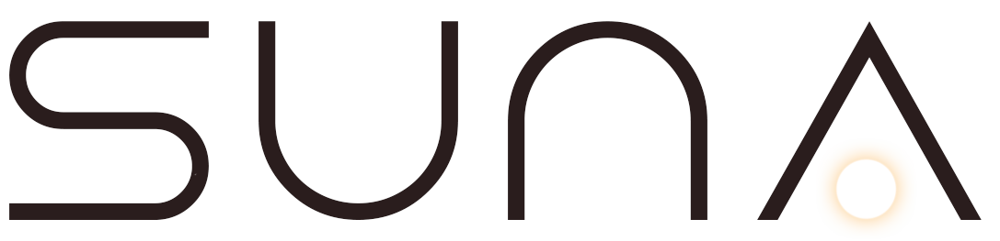
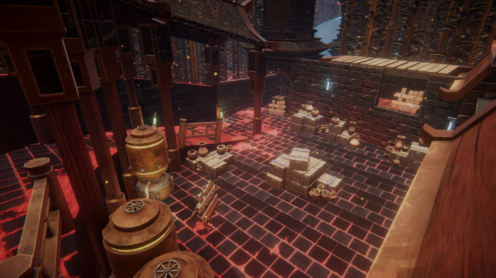
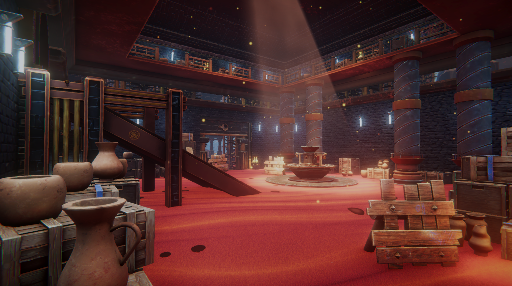
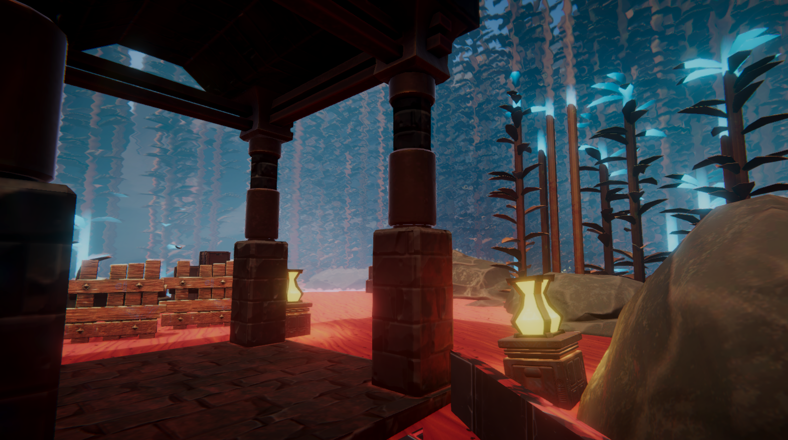
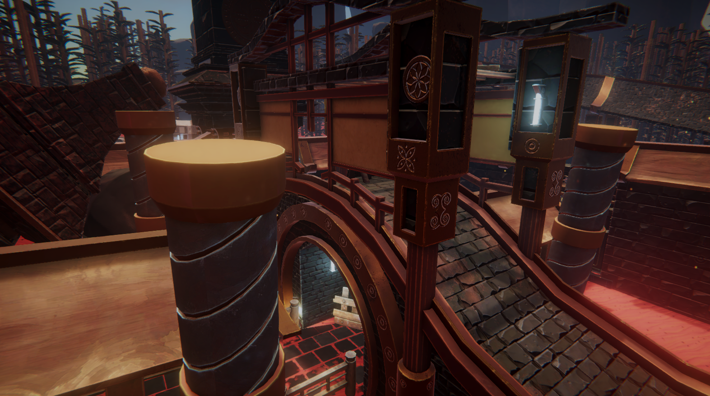
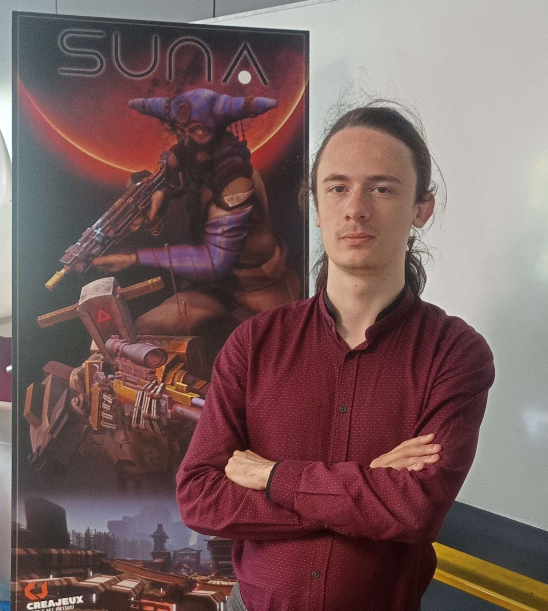
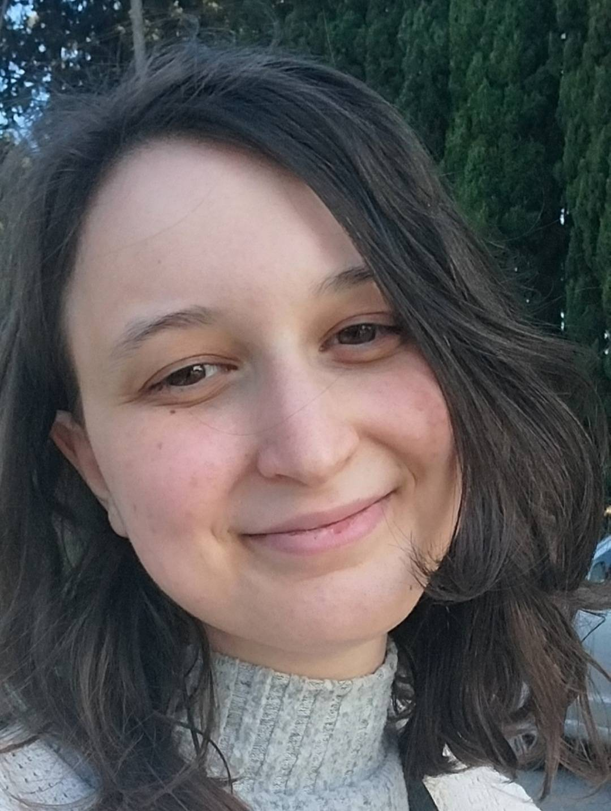
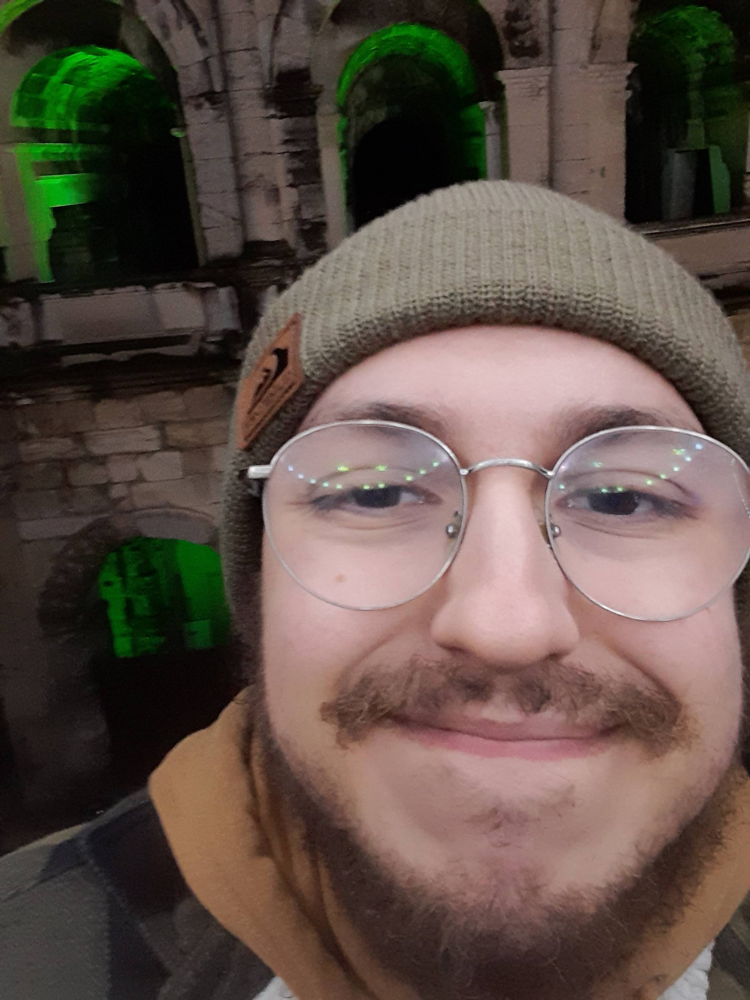
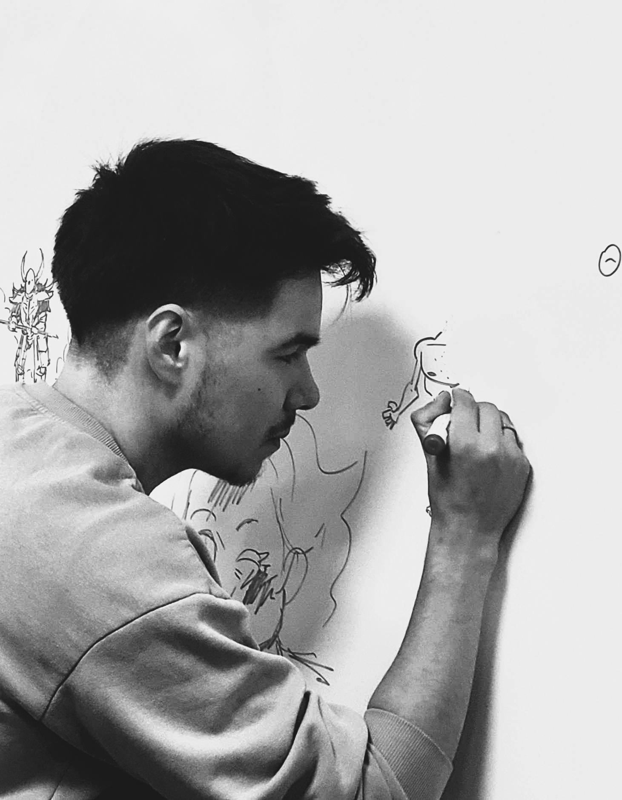

<!-- PROJECT LOGO -->
 

  

  <h3 align="center">SUNA</h3>

  

    Competitive FPS Multiplayer game made by students 
     as their third year final project.
     
    <a href="#">View Trailer</a>
  

<!-- TABLE OF CONTENTS -->

  
Table of Contents

  <ol>
    <li>
      <a href="#about-the-project">About The Project</a>
      <ul>
        <li><a href="#built-with">Built With</a></li>
      </ul>
    </li>
    <li>
      <a href="#getting-started">Getting Started</a>
      <ul>
        <li><a href="#prerequisites">Prerequisites</a></li>
        <li><a href="#installation">Installation</a></li>
      </ul>
    </li>
    <li><a href="#usage">Usage</a></li>
    <li><a href="#roadmap">Roadmap</a></li>
    <li><a href="#contributing">Contributing</a></li>
    <li><a href="#license">License</a></li>
    <li><a href="#contact">Contact</a></li>
    <li><a href="#acknowledgments">Acknowledgments</a></li>
  </ol>

<!-- ABOUT THE PROJECT -->
## About The Project

    

 

> Suna is a planet, home of a powerful substance praised by the local populations for spiritual reasons.
>
> The Corporation, out-of-Suna military contractors, covet this substance for profit and medical treatments.
>
> Ruthless drones facing Native warriors driven by faith, turning the conflict into a holy war.

 
SUNA is a competitive FPS multiplayer game targeting competitive players.

The game was developped in 44 business days from January 6 to May 22. SUNA was inspired by
[Counter Strike](https://www.counter-strike.net/) and [Valorant](https://playvalorant.com/fr-fr/).

(<a href="#readme-top">back to top</a>)

### Built With

Below is a list of tools we used during this project

-333?style=for-the-badge&logo=unity&logoColor=%23FFFFFF)
 

 

 
![Github][github-shield]
 

 

 

 

 

(<a href="#readme-top">back to top</a>)

<!-- GETTING STARTED -->
## Getting Started

This project is provided "as is".

Go to the [Release section](https://github.com/TimoteeBaboulin/CSLike/releases) of this repository then follow each step provided next.

### Server setup

In order to try the game and play with your friends, **one of you** need to setup a server :

* Download *Server.zip* and unzip it in a dedicated folder
* Launch *ProjectX.exe* **as Administrator**
* Wait for the Windows command prompt to open
* The application will ask you for the number of players (between 1 and 10) then press Enter
* Wait for about 20 seconds for the server to finalize launch

### Client setup

All players must follow the following instructions :

* Download *Client.zip* and unzip it in a dedicated folder
* Launch *ProjectX.exe*
* Have fun !

(<a href="#readme-top">back to top</a>)

## Screenshots

    

    

    

    

    

(<a href="#readme-top">back to top</a>)

### Contributors:

**Programmers :**

    <!-- Théo -->
    

        

            
 <!-- Image container -->
                
            

            <strong>ARCA Théo</strong> &middot; UI Programmer
        

         
        
<em>I was in charge of implementing the UI using UI Toolkit. Great experience. I learned a lot about UI design and learned on how to make custom elements.</em>

         
         
        

            
            
        

    

    <!-- Timotee -->
    

        

            
 <!-- Image container -->
                
            

            <strong>BABOULIN Timotee</strong> &middot; Lead Programmer
        

         
        <!-- UNCOMMENT THIS SECTION AND PUT YOUR TEXT HERE (AND REMOVE THIS LINE)
        
<em>Lorem ipsum dolor sit amet, consectetur adipiscing elit. Fusce mattis consectetur interdum. Mauris ut neque pharetra, accumsan nunc id, feugiat quam. Vivamus sit amet convallis nisl. Praesent fringilla sollicitudin pharetra. Morbi dapibus lobortis gravida. Aliquam erat volutpat. Fusce cursus at magna non bibendum. Suspendisse potenti.</em>

         
         -->
        

            
            
        

    

    <!-- Adrien -->
    

        

            
 <!-- Image container -->
                
            

            <strong>CLAUDE Adrien</strong> &middot; Gameplay & Animation Programmer
        

         
        
<em>During my experience, I contributed to the following tasks: designing ECS-based simulations, setting up the foundational shooting system, implementing lag compensation for shooting, managing character rotation and replication, and integrating various camera systems (first-person view, spectator camera, free camera). I also developed a hybrid system combining ECS and GameObjects for managing 3D models and their animations, a fully ECS-based animation system, and a system for replicating animations. Additionally, I provided support on ECS architecture and the integration of NetCode for Entities for networking and replication.
          
        Among all these tasks, I particularly enjoyed working on replication management and ECS architecture, which I found especially engaging due to their complexity and their significant impact on networked game performance and behavior.</em>

         
         
        

            
            
            
        

    

    <!-- Thomas -->
    

        

            
 <!-- Image container -->
                
            

            <strong>COYNE Thomas</strong> &middot; Gameplay Programmer
        

         
        <!-- UNCOMMENT THIS SECTION AND PUT YOUR TEXT HERE (AND REMOVE THIS LINE)
        
<em>Lorem ipsum dolor sit amet, consectetur adipiscing elit. Fusce mattis consectetur interdum. Mauris ut neque pharetra, accumsan nunc id, feugiat quam. Vivamus sit amet convallis nisl. Praesent fringilla sollicitudin pharetra. Morbi dapibus lobortis gravida. Aliquam erat volutpat. Fusce cursus at magna non bibendum. Suspendisse potenti.</em>

         
         -->
        

            
            
            
        

    

    <!-- Léonnel -->
    

        

            
 <!-- Image container -->
                
            

            <strong>HAMMEL Leonnel</strong> &middot; Multiplayer Programmer
        

         
        
<em>I developed a new multiplayer architecture using Unity Game Services and Netcode for Entities, focusing on a robust and scalable base layer. The system follows a server-authoritative model with client-side prediction and server reconciliation, allowing for responsive local simulation that is validated by the server and synchronized back to clients
         
         
        I implemented this architecture primarily in C#, while also adapting some of my personal C++ code to integrate seamlessly with Unity and the C# environment. Additionally, I built an automated matchmaking system to support concurrent multiplayer sessions, ensuring smooth player distribution and reliable real-time interaction across multiple games</em>

         
         
        

            
            
            
        

    

    <!-- Aurélien -->
    

        

            
 <!-- Image container -->
                
            

            <strong>REY Aurélien</strong> &middot; Gameplay & Graphics Programmer
        

         
        
<em>Working on SUNA was an enriching experience that pushed me out of my comfort zone. Learning to use DOTS, improving my knowledge on the ECS paradigm and searching for solutions to challenges that may arise on this type of game was very rewarding.
          
        At first, I embraced the role of Game Designer and wrote an eleven pages document describing the ideal goal for SUNA. I, then, worked on the map blocking, closely with the Art Director and Level Artist to find an appropriate scope for the map. Once done, I followed by assuming my real roles as Gameplay and Graphics Programmer. I worked on core gameplay mechanics such as the character controller, grenades, the health system and the shooting behavior. Still working closely with the Artists, I made shaders (spawn dome, tile blending, gods rays, ...) to help with the map visual while still keeping an eye on optimization and performances. Lastly and before going into production, I reviewed mine and my peers' code  looking for unoptimized or unsafe code.</em>

         
         
        

            
            
            
        

    

**Artists :**

    <!-- Sarah -->
    

        

            
 <!-- Image container -->
                
            

            <strong>BAST Sarah</strong> &middot; Rig & Animation Artist
        

         
        <!-- UNCOMMENT THIS SECTION AND PUT YOUR TEXT HERE (AND REMOVE THIS LINE)
        
<em>Lorem ipsum dolor sit amet, consectetur adipiscing elit. Fusce mattis consectetur interdum. Mauris ut neque pharetra, accumsan nunc id, feugiat quam. Vivamus sit amet convallis nisl. Praesent fringilla sollicitudin pharetra. Morbi dapibus lobortis gravida. Aliquam erat volutpat. Fusce cursus at magna non bibendum. Suspendisse potenti.</em>

         
         -->
        

            
            
        

    

    <!-- Brice -->
    

        

            
 <!-- Image container -->
                
            

            <strong>CARPINTEIRO Brice</strong> &middot; Artist
        

         
        <!-- UNCOMMENT THIS SECTION AND PUT YOUR TEXT HERE (AND REMOVE THIS LINE)
        
<em>Lorem ipsum dolor sit amet, consectetur adipiscing elit. Fusce mattis consectetur interdum. Mauris ut neque pharetra, accumsan nunc id, feugiat quam. Vivamus sit amet convallis nisl. Praesent fringilla sollicitudin pharetra. Morbi dapibus lobortis gravida. Aliquam erat volutpat. Fusce cursus at magna non bibendum. Suspendisse potenti.</em>

         
         -->
        

            
            
        

    

    <!-- Camille -->
    

        

            
 <!-- Image container -->
                
            

            <strong>GUINOT Camille</strong> &middot; Lead & Level Artist
        

         
        <!-- UNCOMMENT THIS SECTION AND PUT YOUR TEXT HERE (AND REMOVE THIS LINE)
        
<em>Lorem ipsum dolor sit amet, consectetur adipiscing elit. Fusce mattis consectetur interdum. Mauris ut neque pharetra, accumsan nunc id, feugiat quam. Vivamus sit amet convallis nisl. Praesent fringilla sollicitudin pharetra. Morbi dapibus lobortis gravida. Aliquam erat volutpat. Fusce cursus at magna non bibendum. Suspendisse potenti.</em>

         
         -->
        

            
            
        

    

    <!-- Seb -->
    

        

            
 <!-- Image container -->
                
            

            <strong>MENGÜAL Sebastian</strong> &middot; Art Direction & Supervision
        

         
        <!-- UNCOMMENT THIS SECTION AND PUT YOUR TEXT HERE (AND REMOVE THIS LINE)
        
<em>Lorem ipsum dolor sit amet, consectetur adipiscing elit. Fusce mattis consectetur interdum. Mauris ut neque pharetra, accumsan nunc id, feugiat quam. Vivamus sit amet convallis nisl. Praesent fringilla sollicitudin pharetra. Morbi dapibus lobortis gravida. Aliquam erat volutpat. Fusce cursus at magna non bibendum. Suspendisse potenti.</em>

         
         -->
        

            
            
        

    

**Other contributors :**
* CASAMENTO Thomas &middot; Music Composer
* HOCTOR George Miller &middot; Voice Actor
* MICHEL Kilian &middot; Contributing Artist
* PARDIGON Vincent &middot; Contributing Artist

(<a href="#readme-top">back to top</a>)

<!-- MARKDOWN LINKS & IMAGES -->
<!-- https://www.markdownguide.org/basic-syntax/#reference-style-links -->
[linkedin-shield]: https://img.shields.io/badge/-LinkedIn-black.svg?style=for-the-badge&logo=linkedin&color=0a66c2
[github-shield]: https://img.shields.io/badge/github-%23181717?style=for-the-badge&logo=github&logoColor=%23fff
[website-shield]: https://img.shields.io/badge/Website-%23733?style=for-the-badge&logoColor=%23fff
